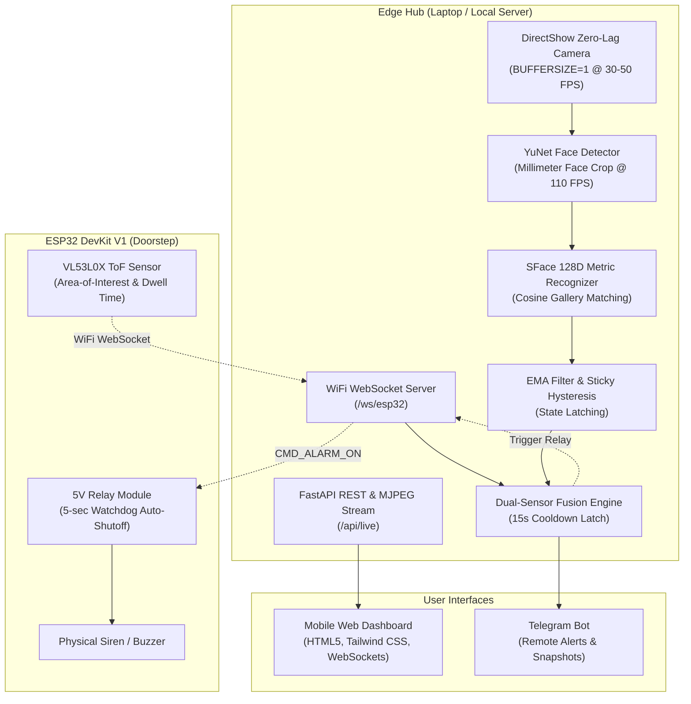

# 🚪 Smart Doorbell Hub: Contactless Edge-AI IoT Security System

An ultra-low latency, contactless smart doorbell and entryway security hub powered by **FastAPI**, **ESP32 DevKit V1**, **YuNet face detection**, and **SFace 128-D deep metric biometric embeddings**.

Runs 100% locally on an edge laptop (accelerated by NVIDIA RTX GPU) with an ESP32 hardware bridge over WiFi WebSockets.

---

## 📸 Key Capabilities

- **Strict Owner-Only Access**:
  - **Resident (Owner)**: Solid **GREEN** bounding box + `[ACCESS GRANTED]` badge.
  - **All Strangers / Visitors**: Solid **RED** bounding box + `[ALERT: STRANGER]` badge.
  - **Evaluating**: **YELLOW** bounding box + `[STATUS: SEARCHING]` badge (momentary initial acquisition only).
- **Millimeter-Tight Face Geometry**: Uses YuNet ONNX (110+ FPS) to frame strictly the face (forehead to chin, cheek to cheek) with elegant corner brackets.
- **Personal Face Enrollment in 3 Seconds**: Dedicated utility (`enroll_me.py`) captures 25–30 multi-angle samples and compiles `resident_gallery.npy` in under 1 second.
- **Flicker-Free Temporal Filtering**: Exponential Moving Average (EMA, $\alpha=0.75$) with sticky hysteresis latching eliminates frame-to-frame score oscillation.
- **Dual-Sensor Fusion**: Combines VL53L0X Time-of-Flight (ToF) distance sensor with camera vision. High Alert triggers only when both sensors confirm presence and dwell time.
- **Physical Siren Actuation**: ESP32 controls a 5V relay driving an external buzzer/siren with a 5-second hardware watchdog auto-shutoff.
- **Local-First Privacy**: No cloud dependencies or WebRTC STUN/TURN servers required. Telegram is the ONLY optional cloud dependency for owner alerts.

---

## 🏗️ System Architecture



---

## 🔌 Hardware Wiring & Bill of Materials (BOM)

| Component | Pin on Component | ESP32 DevKit V1 Pin | Notes |
| :--- | :--- | :--- | :--- |
| **VL53L0X ToF Sensor** | VCC | 3.3V / 5V | Power supply |
| | GND | GND | Ground |
| | SCL | GPIO 22 | I2C Clock |
| | SDA | GPIO 21 | I2C Data |
| **5V Relay Module** | VCC | 5V / VIN | Active HIGH relay |
| | GND | GND | Ground |
| | IN | GPIO 26 | Relay trigger pin |
| | COM / NO | Siren Circuit | Wired in series with Siren battery |
| **Onboard Status LED**| - | GPIO 2 | Solid = WiFi + WS Connected |

---

## 📂 Repository Structure

```
.
├── test_doorbell.py                   # Real-time multi-person vision & biometric classification engine
├── enroll_me.py                       # Personal face enrollment tool (3s rapid webcam capture)
├── face_detection_yunet_2023mar.onnx  # YuNet face detector model (110+ FPS)
├── face_recognition_sface_2021dec.onnx# SFace 128D deep metric embedding model
├── resident_gallery.npy               # Pre-compiled owner biometric gallery
├── known_faces/
│   └── owner/                         # Stored personal face images of the owner
├── backend/
│   ├── main.py                        # FastAPI server with /api/live MJPEG & /ws/esp32
│   ├── config.py                      # System configuration & thresholds
│   ├── database.py                    # SQLite visitor logging and access history
│   └── requirements.txt               # Backend-specific dependencies
├── frontend/
│   └── index.html                     # Responsive mobile dashboard (Tailwind CSS + WebSockets)
├── firmware/
│   └── doorbell_esp32.ino             # ESP32 Arduino firmware for ToF & Relay over WiFi WS
├── requirements.txt                   # Complete Python dependencies
├── .env.example                       # Environment template
└── .gitignore                         # Git ignore rules
```

---

## 🚀 Getting Started

### 1. Installation

Ensure you have Python 3.10+ installed.

```bash
# Clone the repository
git clone https://github.com/your-username/smart-doorbell-hub.git
cd smart-doorbell-hub

# Create virtual environment
python -m venv venv
source venv/bin/activate   # On Windows: .\venv\Scripts\activate

# Install dependencies
pip install -r requirements.txt
```

### 2. Enroll Your Face (Personal Storage)

To store your photos and ensure **only you receive the GREEN box**:

```bash
python enroll_me.py
```
- Sit in front of your webcam.
- The utility gives a 3-second countdown and captures 25–30 angles (straight, left, right, smile).
- Images are automatically saved into `known_faces/owner/` and compiled into `resident_gallery.npy`.

*(Alternatively, drop any photos of yourself into `known_faces/owner/` and run `python enroll_me.py --recompile`)*

### 3. Run Standalone Vision Stream

To run the standalone real-time vision window with GPU acceleration:

```bash
python test_doorbell.py --webcam
```
- **You (Owner)**: Solid **GREEN** bounding box + `[ACCESS GRANTED]`.
- **Anyone Else**: Solid **RED** bounding box + `[ALERT: STRANGER]`.
- **Corner HUD**: Real-time FPS, face counts, and security status.

### 4. Run the Full Smart Doorbell Hub (FastAPI + Web App)

```bash
# Configure your environment
cp .env.example .env

# Start FastAPI server
uvicorn backend.main:app --host 0.0.0.0 --port 8000
```
- **Mobile Web Dashboard**: Open `http://localhost:8000` on any phone or browser connected to the same Wi-Fi network.
- **Live MJPEG Video Feed**: Accessible at `http://localhost:8000/api/live`.
- **Visitor Log Feed**: Real-time event log with timestamps and visitor snapshots.
- **Siren Control**: Push-to-trigger 5-second siren actuation.

### 5. Flash ESP32 Firmware

1. Open `firmware/doorbell_esp32.ino` in Arduino IDE.
2. Install libraries via Library Manager:
   - `Adafruit_VL53L0X`
   - `WebSocketsClient` by Markus Sattler
3. Configure your WiFi credentials and your laptop's local IP address:
   ```cpp
   const char* WIFI_SSID = "YOUR_WIFI_NAME";
   const char* WIFI_PASSWORD = "YOUR_WIFI_PASSWORD";
   const char* WS_HOST = "192.168.1.100"; // Laptop IP running FastAPI
   const uint16_t WS_PORT = 8000;
   ```
4. Upload to your ESP32 DevKit V1. The onboard blue LED will illuminate once connected to the Edge Hub.

---

## 🛡️ Security Logic & Thresholds

| Condition | Metric Boundary | System Response |
| :--- | :--- | :--- |
| **Owner Present** | Top-3 Cosine Similarity $\ge 0.50$ | **GREEN BOX** (`[ACCESS GRANTED]`), No alarm triggered. |
| **Stranger Present** | Top-3 Cosine Similarity $< 0.44$ | **RED BOX** (`[ALERT: STRANGER]`). |
| **Dwell Time Violation** | Distance $< 1.2\text{ m}$ for $> 2.0\text{ s}$ | **HIGH ALERT**: Snapshot logged, siren armed, Telegram dispatch. |
| **Alert Cooldown** | 15 seconds | Prevents dispatch spamming. |
| **Hardware Safety Timeout** | 5000 ms (Hardware Watchdog) | Automatic siren cutoff to protect hardware and avoid continuous alarms. |

---

## 📜 License

MIT License. Developed as a contactless edge-AI security doorbell system.
